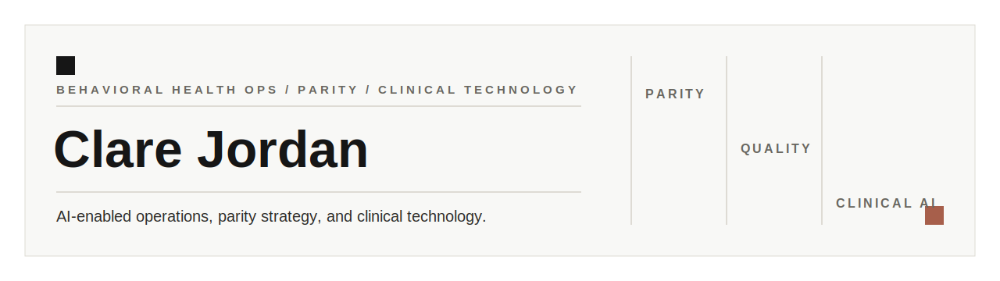

# Hi, I'm Clare Jordan

I am a licensed mental health clinician moving into AI-enabled behavioral health operations, parity strategy, quality improvement, and clinical technology leadership.

My work is strongest where clinical judgment, policy interpretation, operational reality, and clear documentation all need to meet. I use GitHub as the builder-side companion to that work: a place for public-safe examples, workflow thinking, documentation structures, and practical technical practice.

Portfolio: [clarejordan.github.io](https://clarejordan.github.io/)

## What I help with

- Mental health parity and MHPAEA implementation
- NQTL comparative analysis and documentation structure
- Behavioral health policy translation and operational impact review
- Utilization and care management workflow improvement
- Clinical quality improvement, training, and audit readiness
- Responsible AI-assisted workflow and documentation design
- Clear writing that helps clinical, legal, operational, and leadership teams work from the same page

## Public examples

These are fictional, sanitized examples created for portfolio review. They connect to the case study themes on my website:

- [NQTL documentation map](./examples/nqtl-documentation-map.md)
- [AI workflow review checklist](./examples/ai-workflow-review-checklist.md)
- [Clinical quality training brief](./examples/clinical-quality-training-brief.md)
- [State policy technical assistance one-pager](./examples/state-policy-technical-assistance-one-pager.md)
- [Python parity review checklist](./examples/parity_review_checklist.py)

## Portfolio paths

- [Personal portfolio](https://clarejordan.github.io/)
- [Case studies](https://clarejordan.github.io/case-studies.html)
- [Projects](https://clarejordan.github.io/projects.html)
- [Resume](https://clarejordan.github.io/resume.html)
- [Writing](https://clarejordan.github.io/writing.html)

## On GitHub

- Public-safe behavioral health operations examples
- Parity and documentation structures
- AI workflow review and human-in-the-loop thinking
- Python learning and automation practice
- Clinical content and conversation design portfolio work

## A little more human

Before policy, operations, and technology work, I was a therapist, clinical trainer, care management leader, and quality improvement specialist. That background still shapes how I work: I like clarity, kindness, practical tools, and systems that remember there are people on the other side.

[Portfolio](https://clarejordan.github.io/) | [LinkedIn](https://www.linkedin.com/in/clareljordan) | [GitHub](https://github.com/clarejordan) | clare.l.jordan@gmail.com
